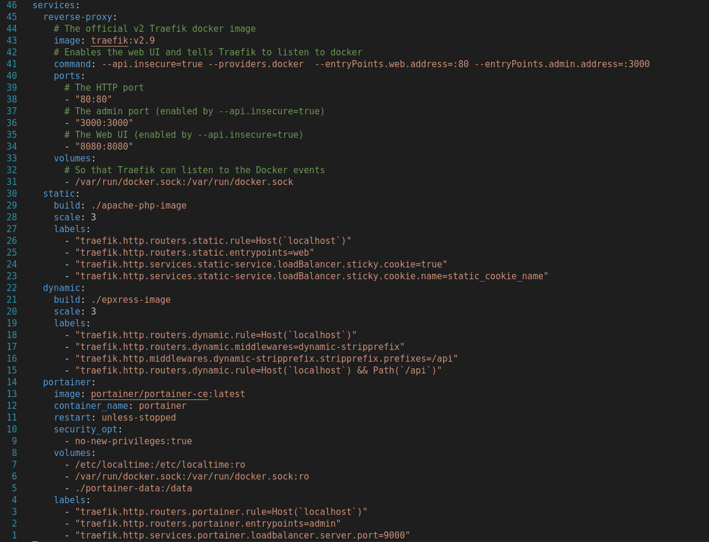
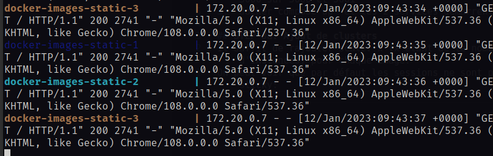
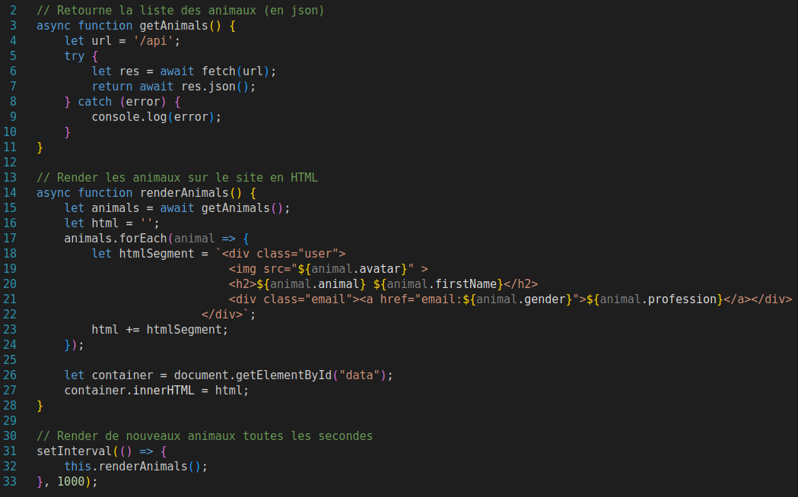
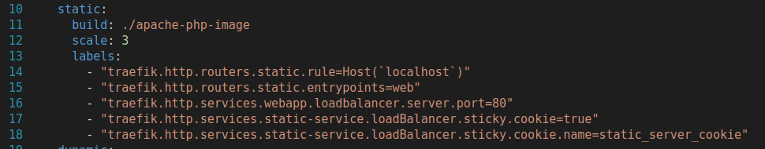
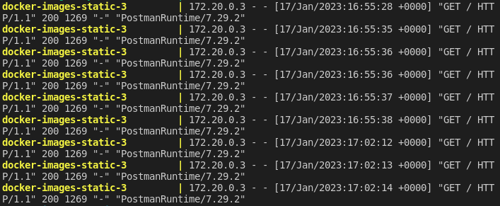

# DAI_Labo_HTTP
Donnée : https://github.com/HEIGVD-Course-DAI/DAI-2022-HTTP-Infra
## STEP 1
### Demo
1. Build l'image Docker : docker build -t dai/apache_php . 
2. Run l'image Docker : docker run -d -p 9090:80 dai/apache_php:latest
3. Accéder au contenu (index.html) du serveur à l'adresse suivante: localhost:9090
### Dockerfile
FROM: permet de donner le nom de l'image parente (~template)
COPY: permet de copier nos dossiers sources locaux dans la container pour que celui-ci puisse les afficher
### Fichiers configs Apache
`/etc/apache2`
C'est ici que sur un serveur Debian se trouve les fichier de configuration pour permettre notamment l'utilisation de Virtual Hosts

## STEP 2 TODO: SCRIPT MODIF DOCKERFILE POUR NPM INSTALL ?
### Partie a 
1. Création du fichier Dockerfile qui contient les informations de l'image node à utiliser ainsi que les 
actions qui seront effectuées avec celle-ci: coper le code puis l'éxécuter.
2. Installation de chance avec: npm install --save chance. Chance est un programme que l'on peut trouver
sur npm qui est le package manager de node
3. Utilisation de Chance dans le code pour saluer chaleuresement des peronnes aux hasard
4. Docker build
5. Docker run qui affiche bien le nom d'une personne aléatoire
### Partie b
1. Installation du framework Express dans notre dossier source: npm install --save express
2. Ecriture du code Express qui permet de renvoyer des personnes aléatoires sous format JSON
en utilisant Chance (déjà vu dans la partie a)
3. Pour tester notre code nous allons maintenant utiliser 2 méthodes différentes:
- Utilisation de busybox: ce container va nous permettre de nous "infiltrer" directement dans le réseau et accèder via cette busybox à notre serveur node.
On récupère l'adresse ip de notre container avec "docker inspect NOM_DU_CONTAINER", puis en observant le champs IPAdress 
- La 2ème méthode consiste à mapper le port de notre container sur un port localhost avec la commande suivante: docker run --publish 3000:3000 dai/express. Nous pouvons désormais utiliser Postman ou Insomnia pour effectuer des requêtes HTTP préparées sur notre localhost:3000

## STEP 3: Docker
1. Création du fichier docker-compose.yml
Globalement dans ce fichier de configuration nous allons donner les service que nous voulons lancer ainsi que leur caractéristiques.
Attention : Si on a EXPOSE nos ports dans les Dockerfile, il n y a pas besoin de mettre les lignes de configuration de port dans ce fichier.

2. "docker compose build" pour build tous nos services ainsi que l'ensemble 
3. "docker compose up" et les 2 services démarrent

## STEP 3a: Ajout de clusters
Il suffit de rajouter scale: x (x étant de le nombre d'instances) pour chaque image.
On peut voir que par défaut les sessions ne sont pas sticky: 

## STEP 4: AJAX avec Fetch API
Voici le code côté client (frontend) qui va permettre à intervalle régulier de redemander de nouvelles données au server express (backend) et les rafficher.
J'ai utilisé pour faire la Fetch API

## STEP 5: Sticky sessions
Pour rendre notre serveur static en sticky sessions il suffit de rajouter les lignes 17 et 18

Preuve que les sessions sont maintenant sticky grâce à plusieurs requêtes Postman de suite :

## STEP 6: Management UI